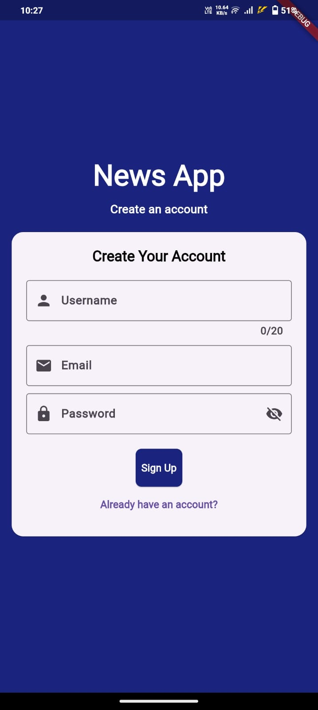

# 📰 News Now

A modern news application built with Flutter, providing a dynamic and personalized news-reading experience. Users can browse trending news, search for specific topics, save articles for later reading, and manage their preferences with a seamless user authentication system.

---

## ✨ Features
- **Dynamic News Feed**: Fetches real-time news articles from a powerful API.  
- **Category-Based Browsing**: Easily filter news by categories like Sports, Politics, and Business.  
- **User Authentication**: Secure sign-in and sign-up with Firebase.  
- **Persistent Saved Articles**: Bookmark articles that are saved to your local device, even after the app is closed.  
- **Search Functionality**: Find articles on any topic using a dedicated search page.  
- **Dark Mode**: A built-in toggle to switch between light and dark themes for comfortable reading.  
- **Responsive UI**: A clean, modern interface that looks great on any device.  

---

## 🚀 Technologies Used
- **Flutter**: UI framework for building beautiful, natively compiled applications.  
- **Dart**: Programming language for Flutter.  
- **Firebase Authentication**: For user sign-in and sign-up.  
- **Cloud Firestore**: A NoSQL cloud database for storing user data.  
- **NewsAPI**: The REST API used to fetch live news articles.  
- **shared_preferences**: A Flutter plugin for simple local data persistence.  

---

## 📸 Screenshots  

  
  
  

  
  
  
  

